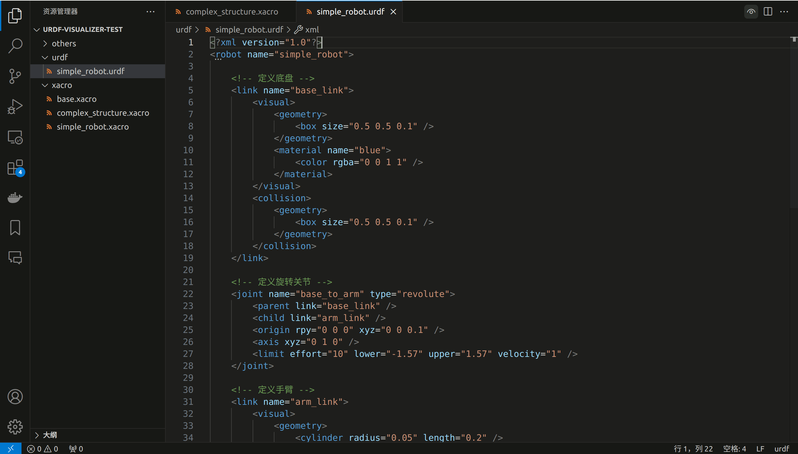

<div align="center"> 


<h1>Urdf Visualizer</h1>

English / [简体中文](./README_zh-CN.md)

A VSCode extension for visualizing URDF files and xacro files.

用于可视化 URDF 和 xacro 文件的 VSCode 扩展.


</div>

## Features



- Visualization of URDF and Xacro files
- Switch the display of visual and/or collision
- Visualize joint and/or link coordinate systems
- Display the joint name when hovering the mouse
- Drag and control joint angles

## Extension Settings

This extension contributes the following settings:

- `urdf-visualizer.packages`: The root directory of ROS/ROS2 packages, used to resolve the `package://<package_name>` paths in URDF/Xacro files. It is recommended to set this in the `.vscode/settings.json` of your workspace as an object, where the key is the package name and the value is its path. Example:
  ```json
  // settings.json
  {
    // other settings
    "urdf-visualizer.packages": {
        "fake_robot": "${workspaceFolder}/src/fake_robot"
    },
    // other settings
  }
  ```
  > [!NOTE]
  > Currently, only `${workspaceFolder}` and `${env:<environment_variables>}` are supported as special symbols in the path:
  > - `${workspaceFolder}` represents the absolute path of the workspace
  > - `${env:<environment_variables>}` represents the value of the environment variable `<environment_variables>`
- `urdf-visualizer.renderOnSave`: Whether to automatically re-render when the file is saved.
- `urdf-visualizer.reRenderWhenSwitchFile`: Whether to automatically re-render when switching between active files.
- `urdf-visualizer.backgroundColor`: Set the background color; it needs to be a hexadecimal color code starting with `#`.

## Operating Instructions

- Rotate perspective: Hold down the left mouse button and drag in the blank space
- Moving perspective: Hold down the right mouse button and drag
- Rotate/Move Joint: Hold down the left mouse button and drag on the link directly connected to the joint

## Install

There are three installation methods:
- Search for "URDF Visualizer" in VSCode extensions and install it.
- In VSCode, use `Ctrl+Shift+P` to open the Command Panel and enter `ext install morningfrog.urdf-visualizer`.
- Download the `.vsix` file in the Release of the repository, then select `Install from VISX` in the upper right corner of the VSCode extension, and choose the downloaded `.vsix` file for installation.

## Release Notes

### 2.0.3

Fix the problem of loading mesh files containing subfiles.

### 2.0.2

Fixed some known issues such as `urdf-visualizer.packages` containing `${workspaceFolder}`.

### 2.0.1

Fix the problem of dragging of links while visualizing frames. 

### 2.0.0

Add the visualization of joint angles.

### 1.0.0

Initial release of URDF Visualizer.
