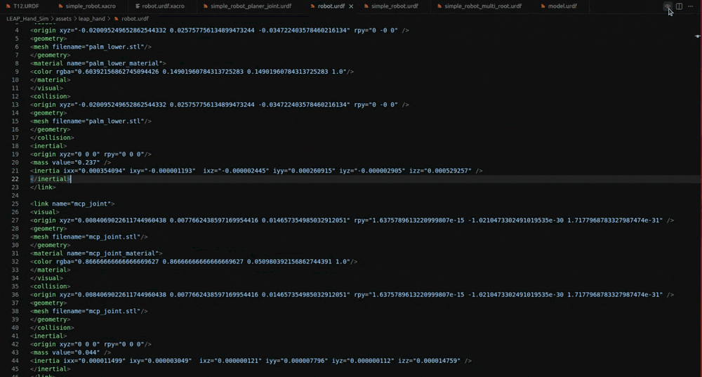
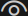
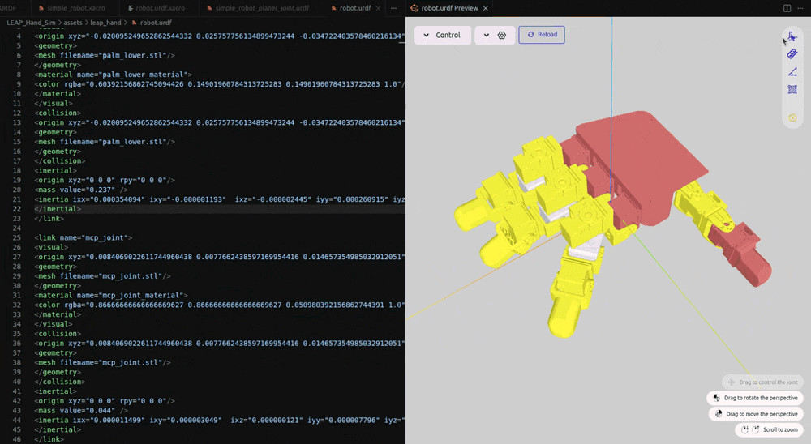

<div align="center"> 


<h1>Urdf Visualizer</h1>

English / [简体中文](./README_zh-CN.md)

A VSCode extension for visualizing URDF files and xacro files.

用于可视化 URDF 和 xacro 文件的 VSCode 扩展.


</div>

## Features



- Preview and inspection: visualize URDF and Xacro files, switch visual/collision display, toggle each link, and inspect joint/link names and frames.
- Interaction: drag joints directly in the viewer, keep the camera view between files, and optionally restore joint values.
- Measurement: measure coordinates, distance, angle, and area, with configurable defaults.
- Interface and localization: new UI with dedicated Control, Links, Joints, and Settings panels, plus English and Simplified Chinese support.
  > If you need more language support, you can raise it in the issue of the repository

## Extension Settings

This extension contributes the following settings, grouped by purpose:

### Package Resolution

- `urdf-visualizer.packages`
  
  Maps ROS/ROS2 package names to local folders so `package://<package_name>` paths in URDF/Xacro files can be resolved. It is recommended to set this in your workspace `.vscode/settings.json`, where **the key is the package name** and **the value is its path**. Example:

  ```json
  // settings.json
  {
    // other settings
    "urdf-visualizer.packages": {
        "fake_robot": "src/fake_robot"
    },
    // other settings
  }
  ```
  Equivalent to:
  ```json
  {
    // other settings
    "urdf-visualizer.packages": {
        "fake_robot": "${workspaceFolder}/src/fake_robot"
    },
    // other settings
  }
  ```

  Supported special path variables:
  - `${workspaceFolder}` represents the absolute path of the workspace
  - `${workspaceFolder:<workspace_name>}` represents the path of a specific workspace in a multi-root workspace.
  - `${env:<environment_variables>}` represents the value of the environment variable `<environment_variables>`
  
  > In URDF Visualizer ≥4.4.0, you can directly use relative paths to represent paths relative to the workspace, without needing the `${workspaceFolder}/` prefix.

### Reload and Caching

- `urdf-visualizer.renderOnSave`: Re-render when the current file is saved.

- `urdf-visualizer.reRenderWhenSwitchFile`: Re-render when switching between active files.

- `urdf-visualizer.cacheCameraView`: Remember and restore the camera view for each file.

- `urdf-visualizer.cacheJointValues`: Remember and restore joint values for each file.

- `urdf-visualizer.cacheMesh`: Cache mesh resources to speed up repeated loads.

### Default Preview State

All `urdf-visualizer.default.*` settings define the initial state of a newly opened preview. They can still be changed later in the webview UI.

- Geometry and frames: `urdf-visualizer.default.showVisual`, `urdf-visualizer.default.showCollision`, `urdf-visualizer.default.showWorldFrame`, `urdf-visualizer.default.showJointFrames`, `urdf-visualizer.default.jointFrameSize`, `urdf-visualizer.default.showLinkFrames`, `urdf-visualizer.default.linkFrameSize`

- Units and colors: `urdf-visualizer.default.lengthUnit`, `urdf-visualizer.default.angleUnit`, `urdf-visualizer.default.collisionColor`

- Measurement defaults: `urdf-visualizer.default.measurement.precision`, `urdf-visualizer.default.measurement.useSciNotation`, `urdf-visualizer.default.measurement.labelSize`, `urdf-visualizer.default.measurement.labelColor`, `urdf-visualizer.default.measurement.lineColor`, `urdf-visualizer.default.measurement.lineThickness`, `urdf-visualizer.default.measurement.pointColor`, `urdf-visualizer.default.measurement.pointSize`, `urdf-visualizer.default.measurement.surfaceColor`

### Appearance and Interaction

- `urdf-visualizer.backgroundColor`: Set the background color of the 3D viewer. It must be a hexadecimal color code starting with `#`.

- `urdf-visualizer.showTips`: Show or hide the operation tips.

- `urdf-visualizer.highlightJointWhenHover`: Highlight the joint frame at the top when hovering.

- `urdf-visualizer.highlightLinkWhenHover`: Highlight the link frame at the top when hovering.

## Instructions

> [!IMPORTANT]
> Open VSCode in a folder that contains all resources required by the URDF/Xacro file. Opening only the single URDF/Xacro file may prevent mesh resources from being found.

There are two ways to start previewing URDF or Xacro files:
- In VSCode, use `Ctrl+Shift+P` to open the Command Panel and enter `URDF Visualizer: Preview URDF/Xacro`.
- Click the  button in the upper right corner of the file.
> Both operations require the URDF/Xacro file to be in an active state.

Operations:
- View control: hold the left mouse button and drag in blank space to rotate; hold the right mouse button and drag to move the view.
- Joint control: hold the left mouse button and drag on the link directly connected to the joint.
- Measurement: click one of the four buttons in the upper right corner to measure coordinates, distance, angle, or area.



## Install

There are three installation methods:
- Search for "URDF Visualizer" in VSCode extensions and install it.
- In VSCode, use `Ctrl+Shift+P` to open the Command Panel and enter `ext install morningfrog.urdf-visualizer`.
- Download the `.vsix` file in the Release of the repository, then select `Install from VSIX` in the upper right corner of the VSCode extension, and choose the downloaded `.vsix` file for installation.

## Known Issues

- When measuring area, if concave polygons appear, the area result may be incorrect

## Release Notes

### 5.0.0

Added:

- New UI design
- Toggle the visibility of each link
- Default configurations for preview and measurement settings, adjustable through VSCode settings
- Preserve camera view and joint angle states when switching files (configurable with `urdf-visualizer.cacheCameraView` and `urdf-visualizer.cacheJointValues`)
- Support for `**` operator (exponentiation) in xacro parsing, thanks to @IvanFan-Van (#19)

### 4.x

- Added multilingual support, configurable operation tips, world frame toggle, and richer joint information in the sidebar.
- Improved model inspection with hover names, joint/link frame visualization and highlighting, joint axis display, and coordinate measurement.
- Expanded measurement features with configurable units, precision, scientific notation, and style settings.
- Improved compatibility and usability with relative package paths, broader math expression support, and friendlier package-not-found prompts.
- Added mesh caching and camera view caching to improve loading speed and file-switching workflow.

### 3.x

- Add measurement functions for distance/angle/area.
- Add operation prompts

### 2.x

- Add the visualization of joint angles.
- Optimized the extension's experience.

### 1.x

Initial release of URDF Visualizer.
