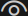

<div align="center"> 


<h1>Urdf Visualizer</h1>

English / [简体中文](./README_zh-CN.md)

A VSCode extension for visualizing URDF files and xacro files.

用于可视化 URDF 和 xacro 文件的 VSCode 扩展.


</div>

## Features


- Visualization of URDF and Xacro files
- Switch the display of visual and/or collision
- Visualize joint and/or link coordinate systems
- Display the joint and link names when hovering the mouse
- Drag and control joint angles
- Measure coordinates, distance, angle or area
- multilingual support: English, Simplified Chinese
  > If you need more language support, you can raise it in the issue of the repository

## Extension Settings

This extension contributes the following settings:

- `urdf-visualizer.packages`
  
  The root directory of ROS/ROS2 packages, used to resolve the `package://<package_name>` paths in URDF/Xacro files. It is recommended to set this in the `.vscode/settings.json` of your workspace as key-value pairs, where **the key is the package name** and **the value is its path**. Example:

  ```json
  // settings.json
  {
    // other settings
    "urdf-visualizer.packages": {
        "fake_robot": "src/fake_robot"
    },
    // other settings
  }
  ```
  Equivalent to:
  ```json
  {
    // other settings
    "urdf-visualizer.packages": {
        "fake_robot": "${workspaceFolder}/src/fake_robot"
    },
    // other settings
  }
  ```

  Currently, only `${workspaceFolder}`, `${workspaceFolder:<workspace_name>}` and `${env:<environment_variables>}` are supported as special symbols in the path:
  - `${workspaceFolder}` represents the absolute path of the workspace
  - `${workspaceFolder:<workspace_name>}` represents the path of a specific workspace in a multi-root workspace.
  - `${env:<environment_variables>}` represents the value of the environment variable `<environment_variables>`
  
  > In URDF Visualizer ≥4.4.0, you can directly use relative paths to represent paths relative to the workspace, without needing the `${workspaceFolder}/` prefix.

- `urdf-visualizer.renderOnSave`
  
  Whether to automatically re-render when the file is saved.

- `urdf-visualizer.reRenderWhenSwitchFile`
  
  Whether to automatically re-render when switching between active files.

- `urdf-visualizer.cacheMesh`

  Whether to enable mesh caching.

- `urdf-visualizer.backgroundColor`
  
  Set the background color; it needs to be a hexadecimal color code starting with `#`.

- `urdf-visualizer.showTips`
  
  Switch the display of operation tips.

- `urdf-visualizer.highlightJointWhenHover`

  Switch whether to highlight joint frame at top on hover.

- `urdf-visualizer.highlightLinkWhenHover`

  Switch whether to highlight link frame at top on hover.

## Instructions

> [!IMPORTANT]
> Open VSCode in the folder contains all files required by the urdf/xacro file. Open VSCode only with the urdf/xacro file will make it unable to find mesh files.

There are two ways to start previewing URDF or Xacro files:
- In VSCode, use `Ctrl+Shift+P` to open the Command Panel and enter `URDF Visualizer: Preview URDF/Xacro`.
- Click the  button in the upper right corner of the file.
> Both operations require the URDF/Xacro file to be in an active state.

Operations:
- Rotate perspective: Hold down the left mouse button and drag in the blank space
- Moving perspective: Hold down the right mouse button and drag
- Rotate/Move Joint: Hold down the left mouse button and drag on the link directly connected to the joint
- Measure coordinates/distance/angle/area: Click the button on one of the four buttons in the upper right corner to start measuring


## Install

There are three installation methods:
- Search for "URDF Visualizer" in VSCode extensions and install it.
- In VSCode, use `Ctrl+Shift+P` to open the Command Panel and enter `ext install morningfrog.urdf-visualizer`.
- Download the `.vsix` file in the Release of the repository, then select `Install from VISX` in the upper right corner of the VSCode extension, and choose the downloaded `.vsix` file for installation.

## Known Issues

- When measuring area, if concave polygons appear, the area result may be incorrect

## Release Notes

### 4.7.0

Added:

- Camera view caching. Restores the previous camera position when switching between different URDF/Xacro files.

### 4.6.x

Added:

- Support for Mesh caching to speed up loading for the same resource files

- `urdf-visualizer.cacheMesh` setting: enable/disable mesh caching

### 4.5.x

Added:

- Support for more mathematical expressions

Improved:

- More user-friendly prompts when packages are not found

### 4.4.x

Added:

- Force highlighting of joint frames or/and link frames (joint frames shown by default) when hovering.
- `urdf-visualizer.highlightJointWhenHover` and `urdf-visualizer.highlightLinkWhenHover` can be used to configure whether to force highlighting of joint frames or/and link frames when hovering.

Improved:

- `urdf-visualizer.packages` now supports relative paths directly, eliminating the need to add `${workspaceFolder}`.
- Optimized the display of coordinate frames, automatically adjusting their size based on the model scale. 
- Improved the display and adjustment of joints. 

### 4.3.x

Added: 

- Tooltips for certain options
- Display for Joint axis
- Measurement of coordinate values

Improved: 

- Differentiated Joint and Link coordinate frames with solid and dashed lines, respectively
- Highlighted corresponding Joint and Link coordinate frames when hovering over the model

### 4.2.x

- Added display of Link names when hovering.

### 4.1.x

- Add type prompts to the right of the Joint name in the sidebar.
- The continuous joint angle can be adjusted from $-2\pi$ to $2\pi$.
- Added a toggle to show/hide the world frame.

### 4.0.x

- Added multilingual support (i18n), automatically selecting extension languages based on VSCode language.
- Optimized the operation tips and added a setting to switch the display of operation tips.

### 3.x

- Add measurement functions for distance/angle/area.
- Add operation prompts

### 2.x

- Add the visualization of joint angles.
- Optimized the extension's experience.

### 1.x

Initial release of URDF Visualizer.
