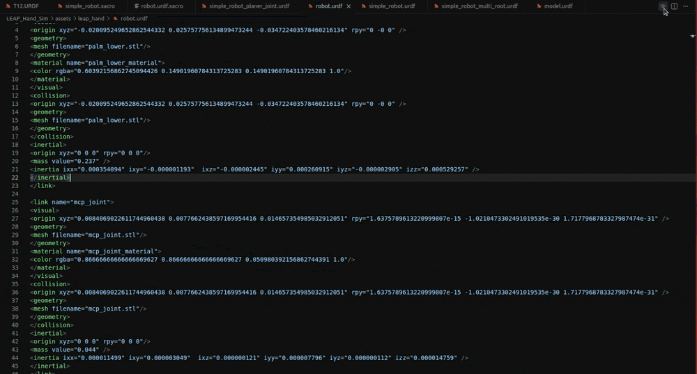
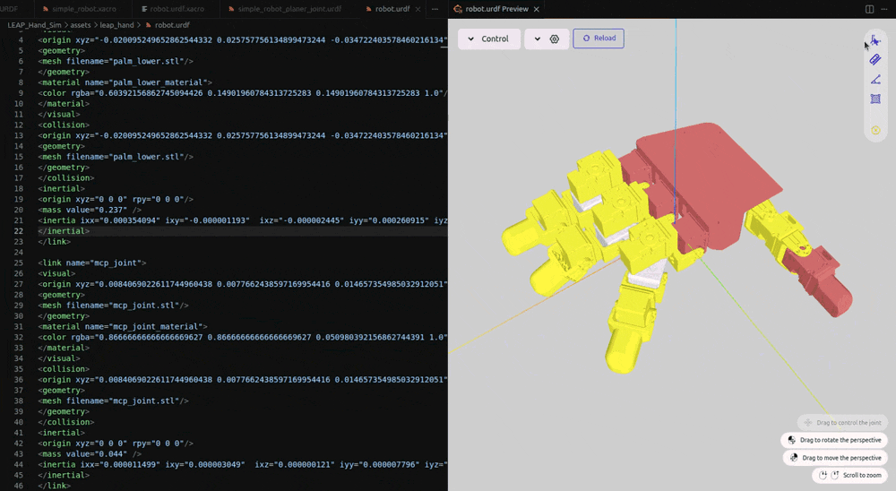

<div align="center"> 


<h1>Urdf Visualizer</h1>

[English](./README.md) / 简体中文

A VSCode extension for visualizing URDF files and xacro files.

用于可视化 URDF 和 xacro 文件的 VSCode 扩展.


</div>

## 特性



- URDF 和 Xacro 文件的可视化
- 切换 visual 和/或 collision 的显示
- 可视化 joint 和/或 link 坐标系
- 鼠标悬浮时显示 joint 和 link 的名称
- 能直接拖动控制关节角度
- 测量坐标值、距离、角度或面积
- 多语言支持: 英语, 简体中文
  > 如果你需要更多语言支持, 可以在仓库的 Issue 中提出

## 扩展设置

该扩展包括以下设置:

- `urdf-visualizer.packages`
  
  ROS/ROS2 功能包的根目录, 用于定位 URDF/Xacro 文件中的 `package://<package_name>` 路径. 建议在工作空间的 `.vscode/settings.json` 中设置, 为键值对, **key 为功能包名称**, **value 为其路径**, 例:
  
  ```json
  // settings.json
  {
    // other settings
    "urdf-visualizer.packages": {
        "fake_robot": "src/fake_robot"
    },
    // other settings
  }
  ```
  等价于:
  ```json
  {
    // other settings
    "urdf-visualizer.packages": {
        "fake_robot": "${workspaceFolder}/src/fake_robot"
    },
    // other settings
  }
  ```

  当前支持 `${workspaceFolder}`、`${workspaceFolder:<workspace_name>}` 和 `${env:<environment_variables>}` 作为特殊符号出现在路径中: 
  - `${workspaceFolder}` 表示工作空间路径
  - `${workspaceFolder:<workspace_name>}` 表示多根工作区(multi-root workspace)中某个工作空间的路径
  - `${env:<environment_variables>}` 表示环境变量 `<environment_variables>` 的值
  
  > 在 ≥4.4.0 的 URDF Visualizer 中可以直接使用相对路径表示相对于工作空间的路径, 无需 `${workspaceFolder}/` 前缀

- `urdf-visualizer.renderOnSave`
  
  是否在文件保存时自动重新渲染.

- `urdf-visualizer.reRenderWhenSwitchFile`
  
  是否在激活的文件切换时自动重新渲染.

- `urdf-visualizer.cacheMesh`

  是否使用 mesh 缓存.

- `urdf-visualizer.backgroundColor`
  
  设置背景颜色, 需要为 `#` 开头的十六进制颜色代码.
  
- `urdf-visualizer.showTips`
  
  切换操作提示的显示与否.

- `urdf-visualizer.highlightJointWhenHover`

  切换鼠标悬停时是否强制顶端高亮显示 joint 坐标系.

- `urdf-visualizer.highlightLinkWhenHover`

  切换鼠标悬停时是否强制顶端高亮显示 link 坐标系.

## 说明

> [!IMPORTANT]
> 在文件夹下打开 VSCode, 文件夹下应当包含 URDF/Xacro 文件所需的所有资源文件. 仅用 VSCode 打开单个文件会让其找不到 mesh 文件.

有两种方式开始预览 URDF 或 Xacro 文件:
- 在 VSCode 中使用 `Ctrl+Shift+P` 打开命令栏, 选择 `URDF Visualizer: Preview URDF/Xacro`
- 单击文件右上角的  按钮
> 两种操作都要求 URDF/Xacro 文件处于激活状态

操作:
- 转动视角: 在空白处按住鼠标左键并拖动
- 移动视角: 按住鼠标右键拖动
- 转动/移动关节: 在关节直接连接的link上按住鼠标左键并拖动 
- 测量坐标值/距离/角度/面积: 鼠标左键单击右上方四个按钮中的一个开始测量



## 安装

有三种安装方式:
- 在 VSCode 的扩展中搜索 URDF Visualizer 并安装.
- 在 VSCode 中使用 `Ctrl+Shift+P` 打开命令栏, 输入 `ext install morningfrog.urdf-visualizer`.
- 在该仓库的 Release 中下载 `.vsix` 文件, 然后在 VSCode 的扩展右上角选择 "从VISX安装", 选择下载的 `.vsix` 文件进行安装.


## 已知问题

- 面积测量时, 如果出现凹多边形, 面积结果可能错误.

## Release Notes

### 4.7.0

增加:

- 相机视角缓存. 使得在不同 URDF/Xacro 文件中切换时恢复之前的相机位置.

### 4.6.x

增加:

- 支持 mesh 缓存, 加速同一资源文件的加载

- `urdf-visualizer.cacheMesh` 设置: 是否使用 mesh 缓存

### 4.5.x

增加:

- 支持更多数学表达式

优化:

- 找不到包时的提示更友好

### 4.4.x

增加:

- 鼠标悬停时强制顶端高亮显示 joint 坐标系或/和 link 坐标系(默认显示 joint 坐标系)
- `urdf-visualizer.highlightJointWhenHover` 和 `urdf-visualizer.highlightLinkWhenHover` 可用于设置鼠标悬停时强制顶端高亮显示 joint 坐标系或/和 link 坐标系

优化:

- `urdf-visualizer.packages` 可以直接使用相对路径，不再需要添加 `${workspaceFolder}`
- 优化坐标系的显示，使其根据模型尺度自动调整尺寸
- 优化关节的显示和调节

### 4.3.x

增加:

- 部分选项的提示
- Joint 的轴显示
- 坐标值的测量

优化: 

- Joint 和 Link 坐标系分别采用实线和虚线以加以区分
- 鼠标悬停在模型上时高亮对应的 Joint 和 Link 坐标系

### 4.2.x

- 在鼠标悬停时增加了 Link 名称的显示

### 4.1.x

- 侧边栏的 Joint 右侧增加类型提示.
- continuous 关节角度可以在 $-2\pi$-$2\pi$ 之间调节.
- 增加了世界坐标系的显示和隐藏的切换.

### 4.0.x

- 添加了多语言支持(i18n), 根据 VSCode 语言自动选择扩展语言.
- 优化了操作提示, 添加了切换操作提示显示与否的设置.

### 3.x

- 增加了距离/角度/面积的测量功能.
- 增加了操作提示.

### 2.x

- 添加了关节角度的可视化.
- 优化了扩展体验.

### 1.x

Initial release of URDF Visualizer.
