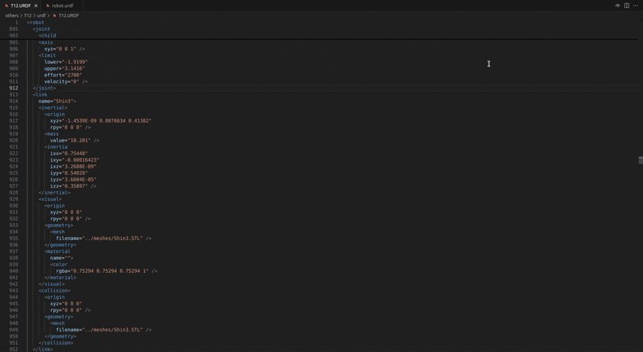
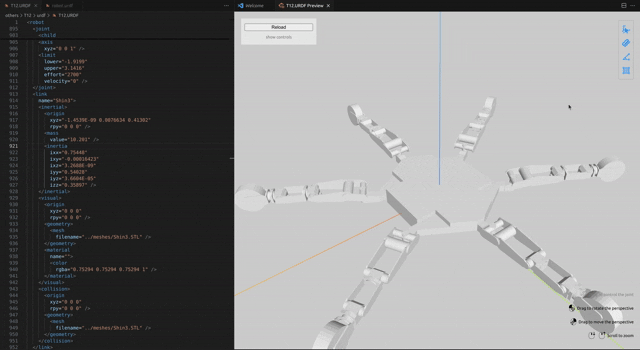

<div align="center"> 


<h1>Urdf Visualizer</h1>

[English](./README.md) / 简体中文

A VSCode extension for visualizing URDF files and xacro files.

用于可视化 URDF 和 xacro 文件的 VSCode 扩展.


</div>

## 特性



- URDF 和 Xacro 文件的可视化
- 切换 visual 和/或 collision 的显示
- 可视化 joint 和/或 link 坐标系
- 鼠标悬浮时显示 joint 和 link 的名称
- 能直接拖动控制关节角度
- 测量坐标值、距离、角度或面积
- 多语言支持: 英语, 简体中文
  > 如果你需要更多语言支持, 可以在仓库的 Issue 中提出

## 扩展设置

该扩展包括以下设置:

- `urdf-visualizer.packages`: ROS/ROS2 功能包的根目录, 用于定位 URDF/Xacro 文件中的 `package://<package_name>` 路径. 建议在工作空间的 `.vscode/settings.json` 中设置, 为一个对象, key 为功能包名称, value 为其路径, 例:
  ```json
  // settings.json
  {
    // other settings
    "urdf-visualizer.packages": {
        "fake_robot": "${workspaceFolder}/src/fake_robot"
    },
    // other settings
  }
  ```
  当前只支持 `${workspaceFolder}` 和 `${env:<environment_variables>}` 作为特殊符号出现在路径中: 
  - `${workspaceFolder}` 表示工作空间路径
  - `${env:<environment_variables>}` 表示环境变量 `<environment_variables>` 的值
- `urdf-visualizer.renderOnSave`: 是否在文件保存时自动重新渲染.
- `urdf-visualizer.reRenderWhenSwitchFile`: 是否在激活的文件切换时自动重新渲染.
- `urdf-visualizer.backgroundColor`: 设置背景颜色, 需要为 `#` 开头的十六进制颜色代码.
- `urdf-visualizer.showTips`: 切换操作提示的显示与否.

## 说明

> [!IMPORTANT]
> 在文件夹下打开 VSCode, 文件夹下应当包含 URDF/Xacro 文件所需的所有资源文件. 仅用 VSCode 打开单个文件会让其找不到 mesh 文件.

有两种方式开始预览 URDF 或 Xacro 文件:
- 在 VSCode 中使用 `Ctrl+Shift+P` 打开命令栏, 选择 `URDF Visualizer: Preview URDF/Xacro`
- 单击文件右上角的  按钮
> 两种操作都要求 URDF/Xacro 文件处于激活状态

操作:
- 转动视角: 在空白处按住鼠标左键并拖动
- 移动视角: 按住鼠标右键拖动
- 转动/移动关节: 在关节直接连接的link上按住鼠标左键并拖动 
- 测量坐标值/距离/角度/面积: 鼠标左键单击右上方四个按钮中的一个开始测量



## 安装

有三种安装方式:
- 在 VSCode 的扩展中搜索 URDF Visualizer 并安装.
- 在 VSCode 中使用 `Ctrl+Shift+P` 打开命令栏, 输入 `ext install morningfrog.urdf-visualizer`.
- 在该仓库的 Release 中下载 `.vsix` 文件, 然后在 VSCode 的扩展右上角选择 "从VISX安装", 选择下载的 `.vsix` 文件进行安装.


## 已知问题

- 面积测量时, 如果出现凹多边形, 面积结果可能错误.

## Release Notes

### 4.3.0

增加:

- 坐标值的测量

修复:

- 测量时图标和功能的同步

### 4.2.0

- 在鼠标悬停时增加了 Link 名称的显示
- 修复以下 bug: 不论 Visual 和 Collider 是否显示, 都按照 Visual 来显示提示和进行操作

### 4.1.2

- 增加了世界坐标系的显示和隐藏的切换

### 4.1.1

- 修复了 SSH remote server 中加载 mesh 的问题
- 优化了关节类型的显示

### 4.1.0

- 侧边栏的 Joint 右侧增加类型提示.
- continuous 关节角度可以在 $-2\pi$-$2\pi$ 之间调节.
- 使用更高版本的 `Three.js`, 这可能解决与Nvidia高版本驱动不相容的问题.

### 4.0.1

- 修复了 1.75 版本以下 VSCode 在 urdf 未被配置为 xml 时无法预览的问题.
- 优化了操作提示, 添加了切换操作提示显示与否的设置.

### 4.0.0

- 添加了多语言支持(i18n), 根据 VSCode 语言自动选择扩展语言.

### 3.x

- 增加了距离/角度/面积的测量功能.
- 增加了操作提示.

### 2.x

- 添加了关节角度的可视化.
- 优化了扩展体验.

### 1.x

Initial release of URDF Visualizer.
