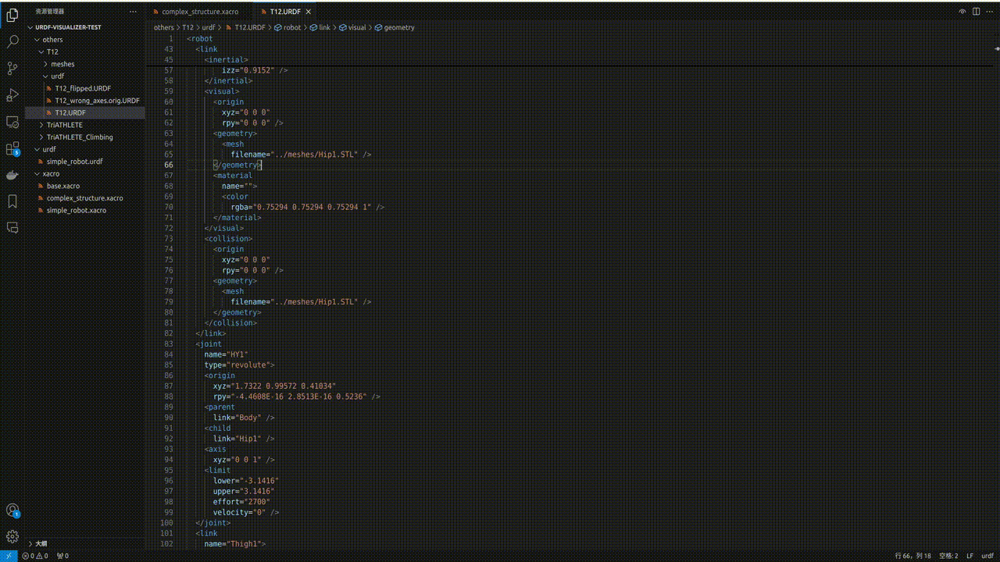

<div align="center"> 


<h1>Urdf Visualizer</h1>

[English](./README.md) / 简体中文

A VSCode extension for visualizing URDF files and xacro files.

用于可视化 URDF 和 xacro 文件的 VSCode 扩展.


</div>

## 特性



- URDF 和 Xacro 文件的可视化
- 切换 visual 和/或 collision 的显示
- 可视化 joint 和/或 link 坐标系
- 鼠标悬浮时显示 joint 名称
- 能直接拖动控制关节角度

## 扩展设置

该扩展包括以下设置:

- `urdf-visualizer.packages`: ROS/ROS2 功能包的根目录, 用于定位 URDF/Xacro 文件中的 `package://<package_name>` 路径. 建议在工作空间的 `.vscode/settings.json` 中设置, 为一个对象, key 为功能包名称, value 为其路径, 例:
  ```json
  // settings.json
  {
    // other settings
    "urdf-visualizer.packages": {
        "fake_robot": "${workspaceFolder}/src/fake_robot"
    },
    // other settings
  }
  ```
- `urdf-visualizer.renderOnSave`: 是否在文件保存时自动重新渲染.
- `urdf-visualizer.reRenderWhenSwitchFile`: 是否在激活的文件切换时自动重新渲染.
- `urdf-visualizer.backgroundColor`: 设置背景颜色, 需要为 `#` 开头的十六进制颜色代码.

## 操作说明

- 转动视角: 在空白处按住鼠标左键并拖动
- 移动视角: 按住鼠标右键拖动
- 转动/移动关节: 在关节直接连接的link上按住鼠标左键并拖动 

## 安装

有三种安装方式:
- 在 VSCode 的扩展中搜索 URDF Visualizer 并安装
- 在 VSCode 中使用 `Ctrl+Shift+P` 打开命令栏, 输入 `ext install morningfrog.urdf-visualizer`
- 在该仓库的 Release 中下载 `.vsix` 文件, 然后在 VSCode 的扩展右上角选择 "从VISX安装", 选择下载的 `.vsix` 文件进行安装

## Release Notes

### 1.0.0

Initial release of URDF Visualizer.
